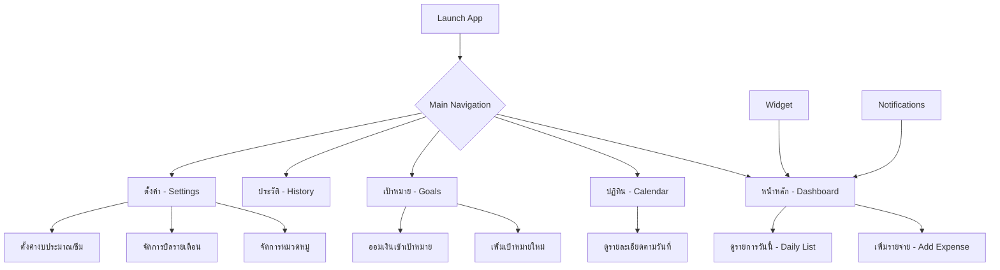
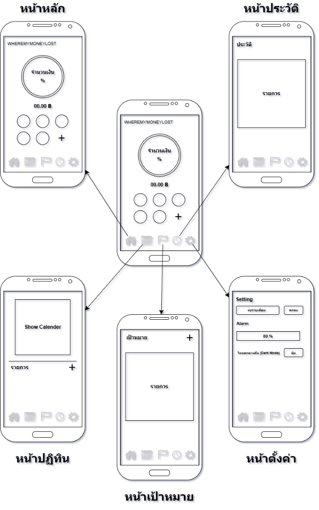

# ผังโครงสร้างหน้าจอและเส้นทางการใช้งาน (Wireframe & User Flow)

เอกสารฉบับนี้อธิบายโครงสร้างหน้าจอ (UI Structure) และเส้นทางการใช้งาน (User Journey) ของแอปพลิเคชัน **WhereMyMoneyLost (เงินหายไปไหน)"** เพื่อให้เห็นภาพการทำงานตั้งแต่ระดับหน้าจอไปจนถึงระบบอัตโนมัติเบื้องหลัง

---

## 1. โครงสร้างแอปโดยรวม (High-Level Architecture)

แอปพลิเคชันแบ่งออกเป็น 5 แท็บหลัก โดยมีระบบแจ้งเตือนและ Widget ทำงานขนานไปเบื้องหลัง

### แผนผังการเชื่อมต่อหน้าจอ (Visual Wireframe)

---

## 2. รายละเอียดหน้าจอ (Wireframe Breakdown)

### A. หน้าหลัก (Main Screen)
**จุดประสงค์**: สรุปภาพรวมการเงินในปัจจุบัน
- **ส่วนบน**: Card สรุปยอด (สีพรีเมียม) แสดง "งบประมาณคงเหลือ" และ "เปอร์เซ็นต์ที่ใช้ไป" พร้อม Progress Bar
- **ส่วนกลาง**: Grid หมวดหมู่ (Icon สวยงาม) แสดงยอดที่ใช้ไปในแต่ละหมวด
- **ปุ่มหลัก (FAB)**: ปุ่ม "+" ขนาดใหญ่สำหรับเพิ่มรายจ่ายทันที
- **ส่วนล่าง**: รายการใช้จ่ายล่าสุด 3-5 รายการ

### B. หน้าเป้าหมาย (Goals Screen)
**จุดประสงค์**: บริหารจัดการเงินออม
- **รายการเป้าหมาย**: Card แสดงชื่อเป้าหมาย, ยอดที่ออมแล้ว / ยอดเป้าหมาย, และแถบความคืบหน้า
- **ระบบโต้ตอบ**: ปุ่ม "ออมเงิน" ในแต่ละ Card เพื่อโยกเงินจากงบประมาณปกติเข้าสู่เป้าหมาย (สร้าง Expense อัตโนมัติในหมวดเงินออม)

### C. หน้าจัดการบิล (Bills Section ใน Settings)
**จุดประสงค์**: ติดตามรายจ่ายที่ต้องจ่ายแน่นอน
- **รายการบิล**: รายการชื่อบิล, ยอดเงิน, วันที่ครบกำหนด
- **สถานะ**: แสดงไอคอน "จ่ายแล้ว" หรือ "ยังไม่ได้จ่าย"
- **ปุ่ม "จ่ายบิล"**: เมื่อกดแล้วระบบจะสร้างรายการ Expense ให้ทันทีและเปลี่ยนสถานะบิลเป็นจ่ายแล้ว

---

## 3. เส้นทางการใช้งานที่สำคัญ (User Flows)

### Flow 1: การเพิ่มรายจ่าย (Manual Entry)
1. ผู้ใช้กดปุ่ม **"+"** ที่หน้าหลัก
2. ปรากฏ **Dialog**: กรอก "ยอดเงิน", "บันทึกช่วยจำ" และเลือก "หมวดหมู่"
3. กด **"ตกลง"**: 
    - บันทึกข้อมูลลง DataStore
    - อัปเดต UI หน้าหลัก (งบประมาณลดลง)
    - อัปเดต Widget และ Ongoing Notification

### Flow 2: การจ่ายบิลที่บันทึกไว้ (Bill to Expense)
1. ผู้ใช้ไปที่ **ตั้งค่า > จัดการบิล**
2. เลือกบิลที่ต้องการ (เช่น ค่าคอนโด) แล้วกดไอคอน **"จ่าย"**
3. ระบบจะสร้าง **Expense** ใหม่ให้โดยอัตโนมัติ โดยใช้ยอดเงินและหมวดหมู่ของบิลนั้น
4. บิลจะถูกทำเครื่องหมายว่า **"จ่ายแล้ว"** (เพื่อไม่ให้แจ้งเตือนซ้ำในเดือนนั้น)

### Flow 3: การออมเงินสู่เป้าหมาย (Goal Contribution)
1. ผู้ใช้ไปที่หน้า **เป้าหมาย**
2. กดปุ่ม **"ออมเงิน"** ที่เป้าหมายที่ต้องการ
3. ระบุ **ยอดเงิน** ที่ต้องการโยกจากงบประมาณมาออม
4. ระบบจะบันทึก **Expense** ลงในหมวด "เงินออม" (เพื่อหักออกจากงบเดือนนั้น) 
5. ยอดใน **SavingGoal** จะเพิ่มขึ้น และ Progress Bar จะขยับ

---

## 4. ระบบอัตโนมัติเบื้องหลัง (Background Logic)

### การตรวจสอบรายจ่ายประจำ (Recurring Check)
- **เมื่อเปิดแอป**: ระบบจะเช็ครายการใน `recurringExpenses`
- **ตรรกะ**: หาก "วันที่ปัจจุบัน >= วันที่กำหนด" และ "รายเดือนนี้ยังไม่มีรายการนี้" -> **สร้าง Expense อัตโนมัติ**

### ระบบการแจ้งเตือน (Notifications)
- **ทุกครั้งที่มีการจ่าย**: เช็คว่า "เปอร์เซ็นต์การใช้จ่าย > ค่าที่ตั้งไว้ (เช่น 80%)" หรือไม่ -> **ส่งคำเตือน**
- **แจ้งเตือนบิล**: ระบบจะเช็คบิลที่ "ยังไม่ได้จ่าย" และ "ครบกำหนดในวันพรุ่งนี้" -> **ส่งคำเตือนล่วงหน้า 1 วัน**

### Widget Sync
- **การอัปเดต**: ทุกครั้งที่มีการเปลี่ยนแปลงข้อมูล ชุดคำสั่ง `SimpleExpenseWidget.updateAllWidgets()` จะถูกเรียกเพื่อรีเฟรชหน้าจอ Widget ทันที

---
*เอกสารฉบับนี้เป็นส่วนสุดท้ายของโครงการ เพื่อใช้เป็นคู่มือสำหรับการพัฒนาต่อหรือทำความเข้าใจระบบในภาพรวม*
